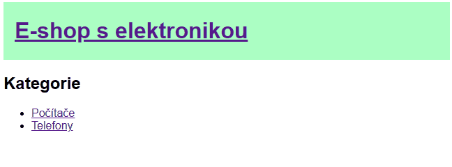

# Cvičení: Vícestránkový web

Vytvoř vícestránkový web pro e-shop s elektronikou.

## Zadání

1. Do všech stránek vlož hlavičku s nadpisem "E-shop s elektronikou".

1. Na úvodní stránce vypiš dva odkazy na kategorie „Počítače“ a Telefony“.

1. Pro počítače založ soubor `pocitace.html` a pro telefony `telefony.html`.

1. U počítačů pod hlavičku s nadpisem přidej text: Omlouváme se, ale všechny počítače jsou momentálně vyprodané.“

1. U telefonů podobně: „Omlouváme se, ale všechny telefony jsou momentálně vyprodané.“

1. Zařiď, aby nadpis na každé stránce vedl zpět na úvodní stránku.

1. Pomocí jednoho sdíleného CSS souboru obarvi všem hlavičkám pozadí na zelenou `#abffc4`.

### Bonus

1. Vylepši CSS. Omez například stránce šířku, aby se na velkých obrazovkách moc neroztahovala. Přidej hlavičce padding. Nastav bezpatkové písmo.

1. Přidej na jednotlivé podstránky podnadpisy, ať je jasnější, co na nich je.

1. Nasaď stránky na GitHub pages.

1. Přidej další podstránky. Třeba další kategorii nebo různé telefony a původní text, že jsou vyprodané nahraď za odkazy.
